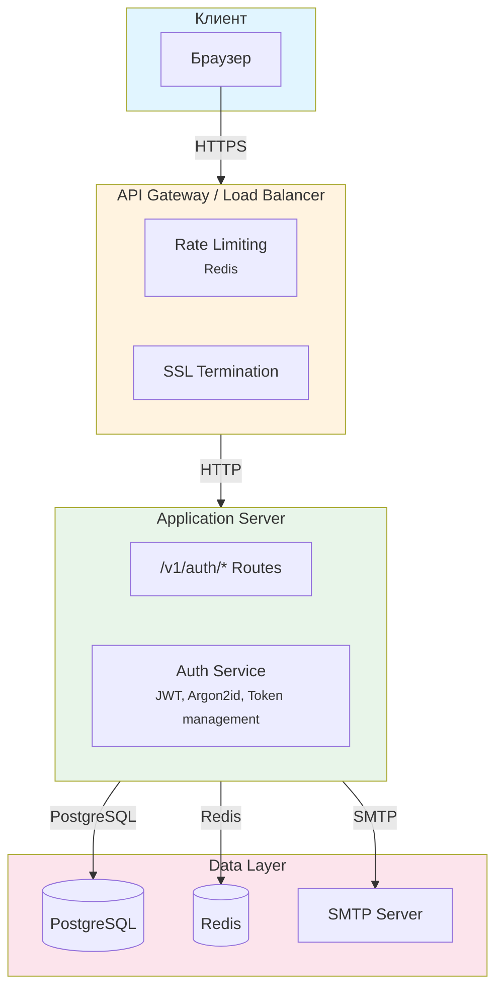
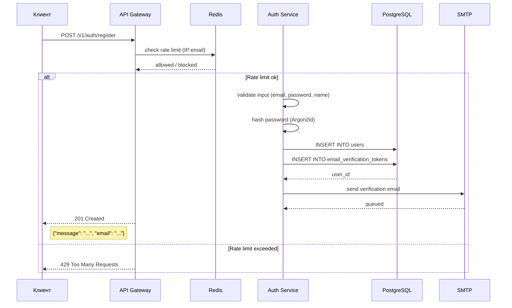
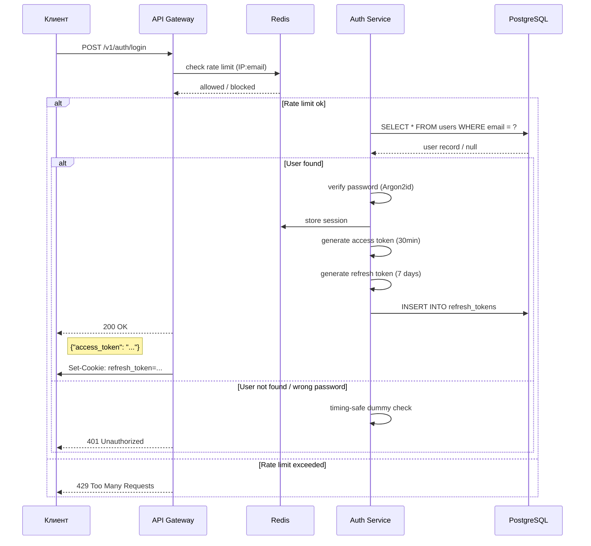
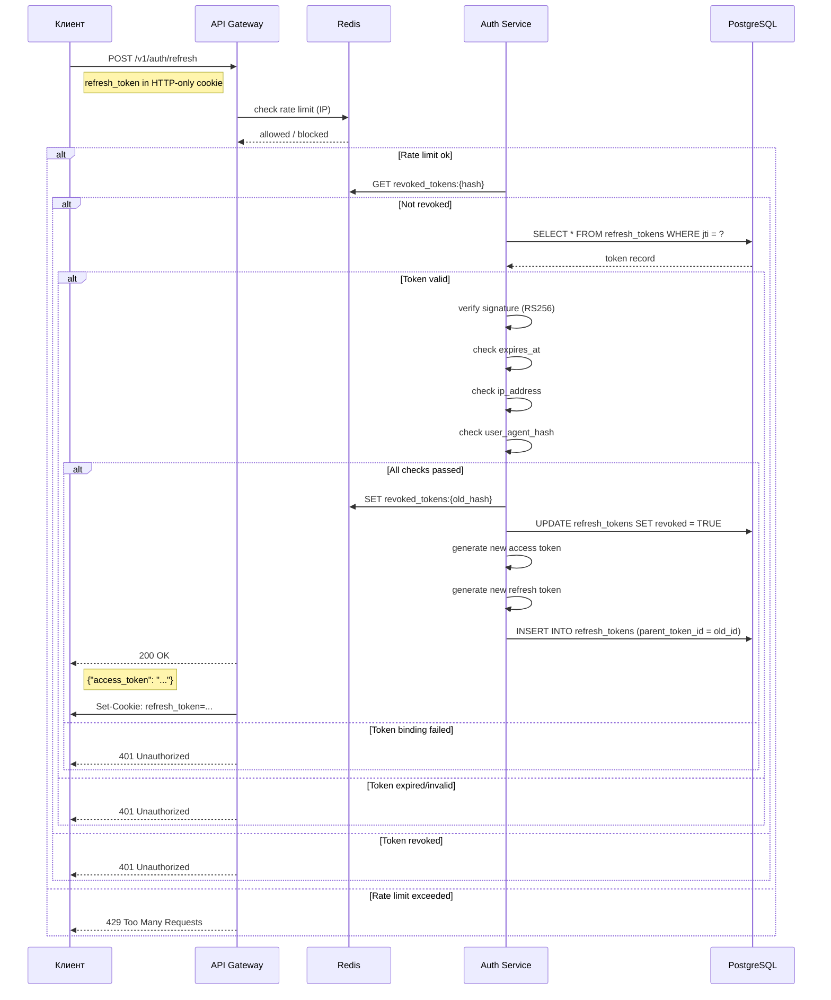

# 1. Архитектура

## 1.1 Общая архитектура системы

Следующая схема показывает общую структуру системы регистрации и авторизации, включая взаимодействие между компонентами:



---

## 1.2 Data Flow Diagrams / Диаграмма потоков данных

### Регистрация пользователя

Следующая диаграмма показывает пошаговый процесс регистрации нового пользователя:



### Аутентификация

Следующая диаграмма показывает процесс входа пользователя в систему:



### Обновление токена

Следующая диаграмма показывает процесс обновления access token через refresh token:



### Выход из системы

Следующая диаграмма показывает процесс выхода пользователя из системы (инвалидация текущей сессии):

```mermaid
sequenceDiagram
    participant C as Клиент
    participant G as API Gateway
    participant R as Redis
    participant A as Auth Service
    participant PG as PostgreSQL

    C->>G: POST /v1/auth/logout
    note right of C: access_token in Authorization header<br/>refresh_token in cookie
    G->>R: check rate limit (IP)
    R-->>G: allowed / blocked
    alt Rate limit ok
        A->>R: GET revoked_tokens:{hash}
        alt Not revoked
            A->>PG: SELECT * FROM refresh_tokens WHERE jti = ?
            PG-->>A: token record
            alt Token valid
                A->>A: verify signature (RS256)
                alt Signature valid
                    A->>R: SET revoked_tokens:{hash}
                    A->>PG: UPDATE refresh_tokens SET revoked = TRUE, revoked_at = NOW()
                    G->>C: Set-Cookie: refresh_token=; Max-Age=0
                    G-->>C: 200 OK
                    note right of C: {"message": "..."}
                else Signature invalid
                    G-->>C: 401 Unauthorized
                end
            else Token expired
                G-->>C: 401 Unauthorized
            end
        else Token already revoked
            G-->>C: 200 OK
        end
    else Rate limit exceeded
        G-->>C: 429 Too Many Requests
    end
```

---

## 1.3 Компоненты системы

### Базы данных

| Компонент | Назначение |
|-----------|------------|
| PostgreSQL | Хранение пользователей, токенов, логов |
| Redis | Rate limiting, сессии, черные списки токенов |

### Основные сервисы

| Компонент | Назначение |
|-----------|------------|
| API Gateway | Rate limiting, SSL termination |
| Auth Service | JWT generation/verification, password hashing, token management |

### Внешние сервисы

| Компонент | Назначение |
|-----------|------------|
| SMTP Server | Отправка email (верификация, сброс пароля) |
