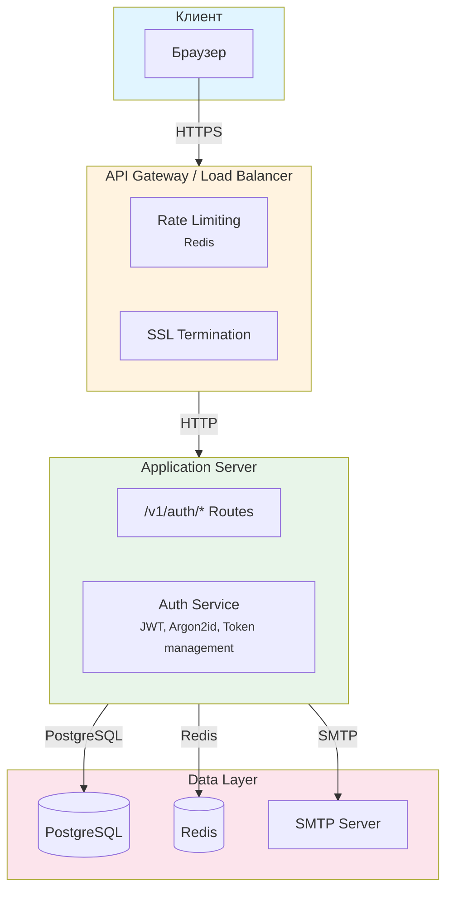
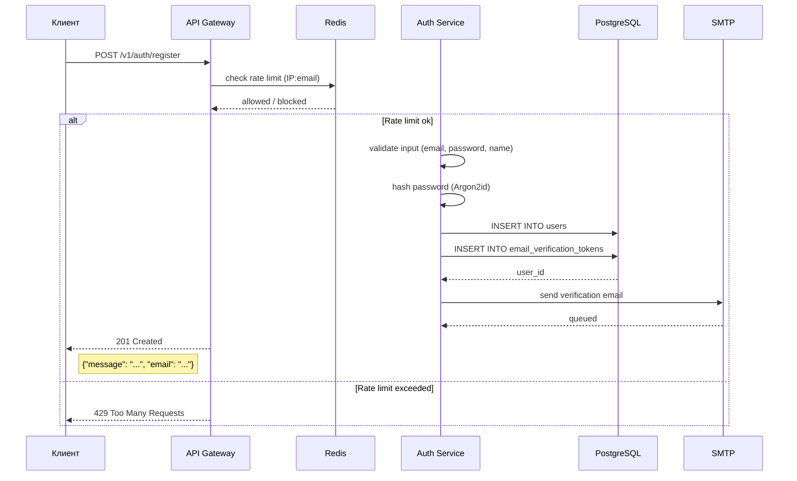
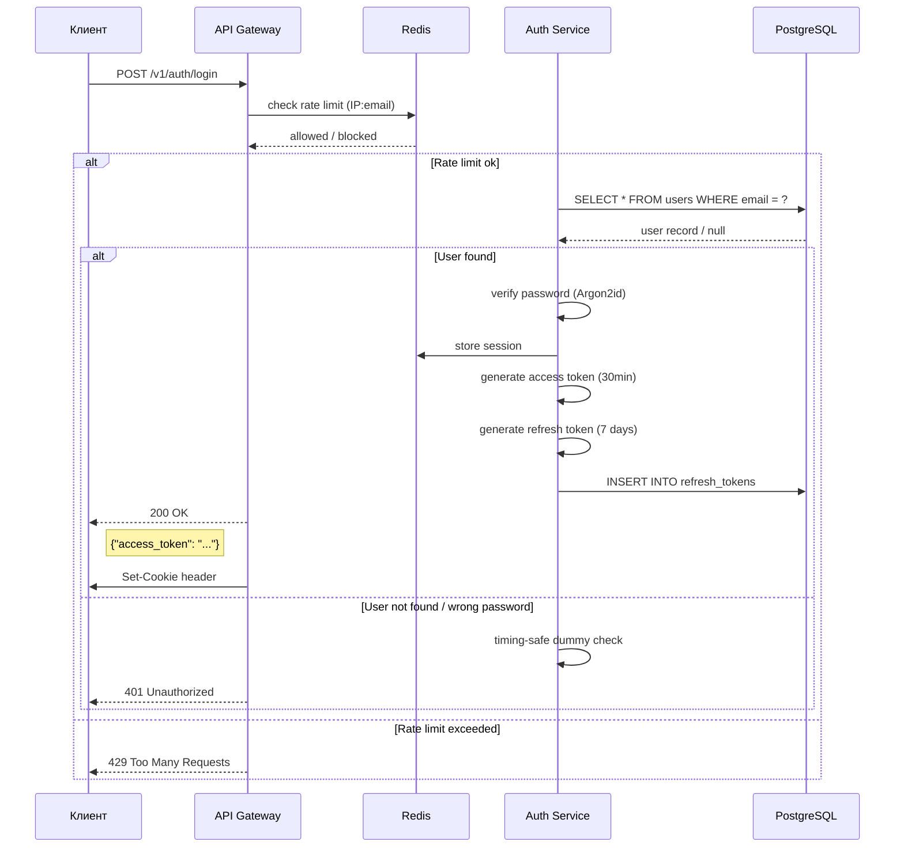
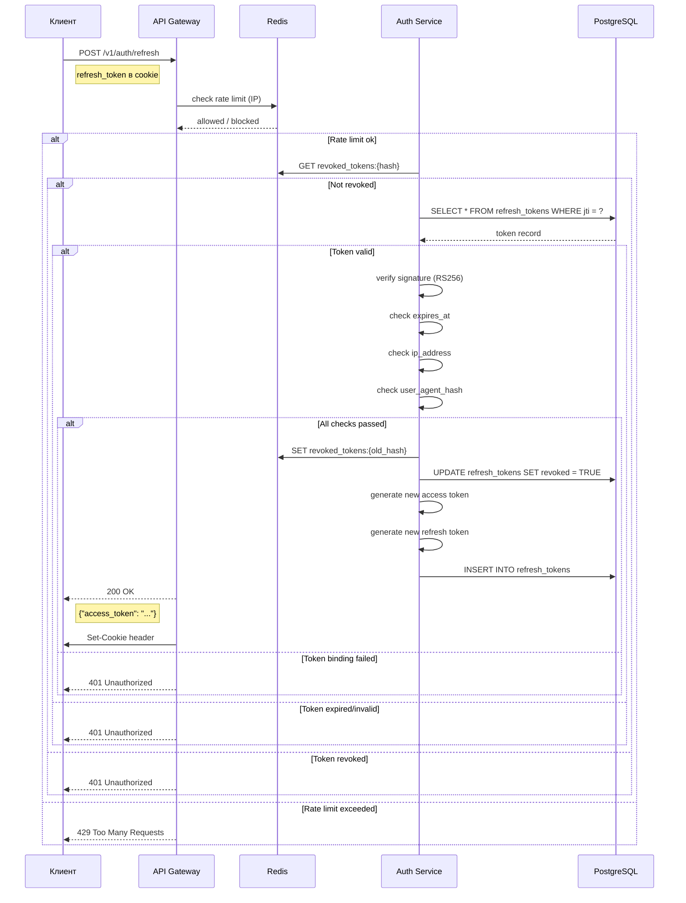
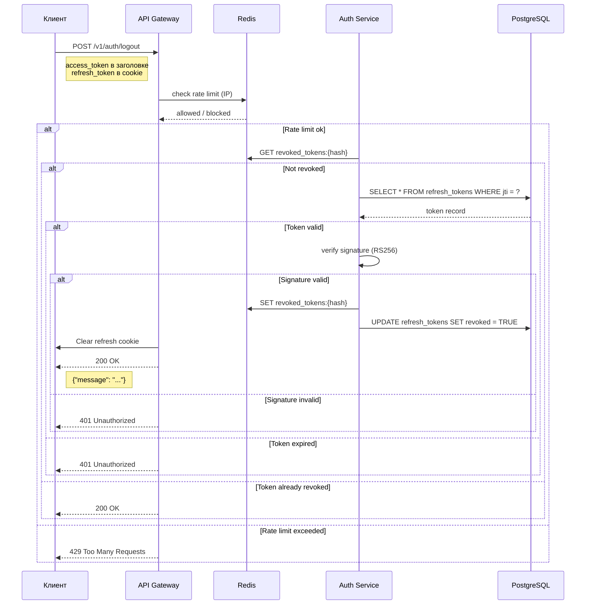
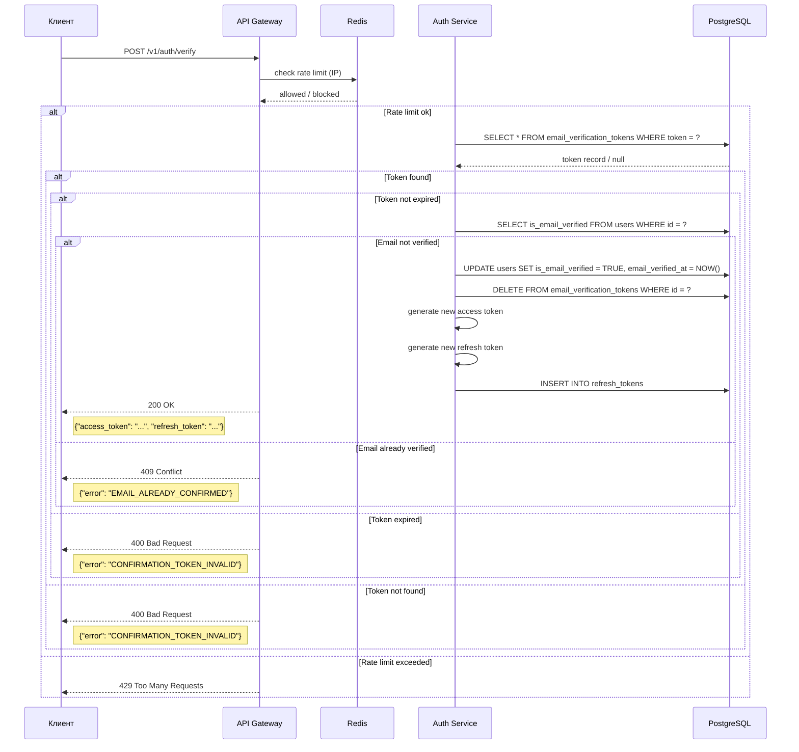
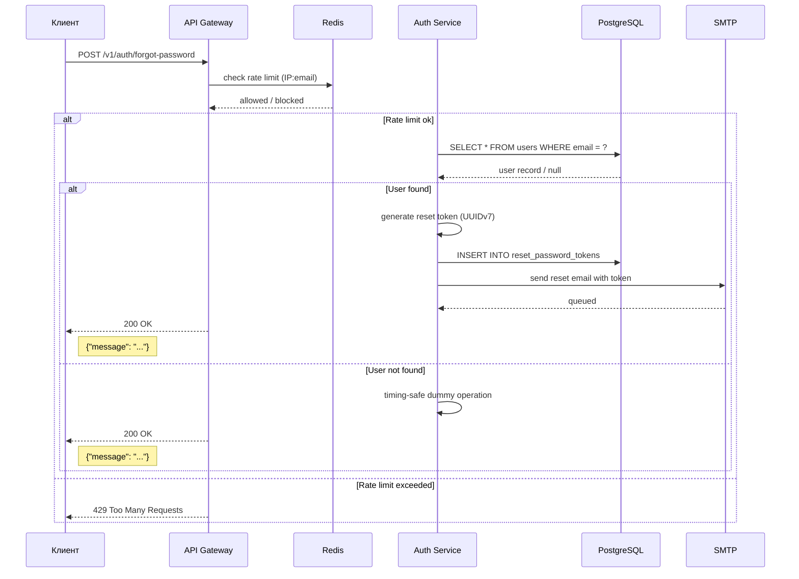
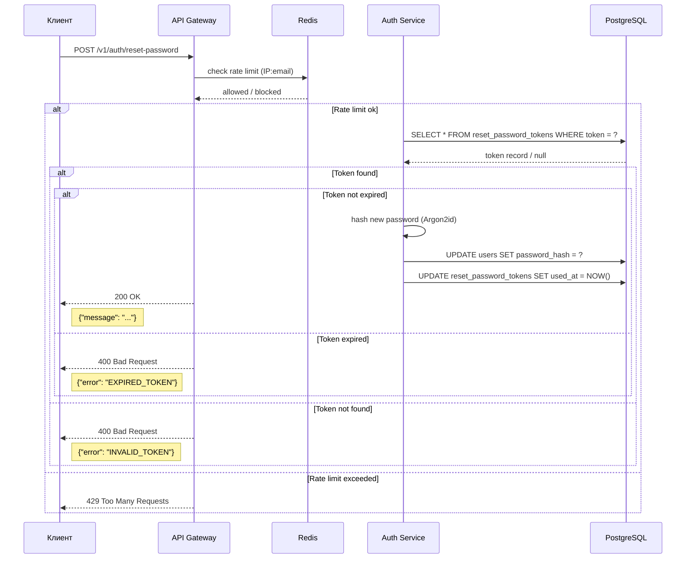
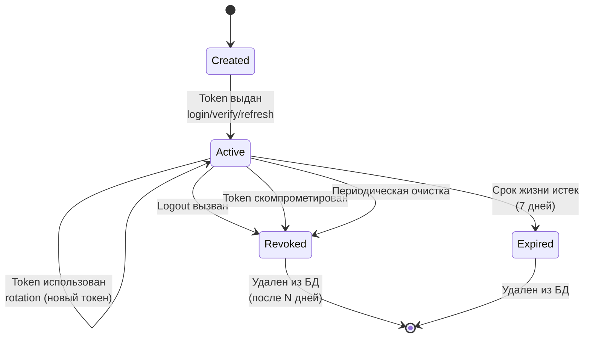
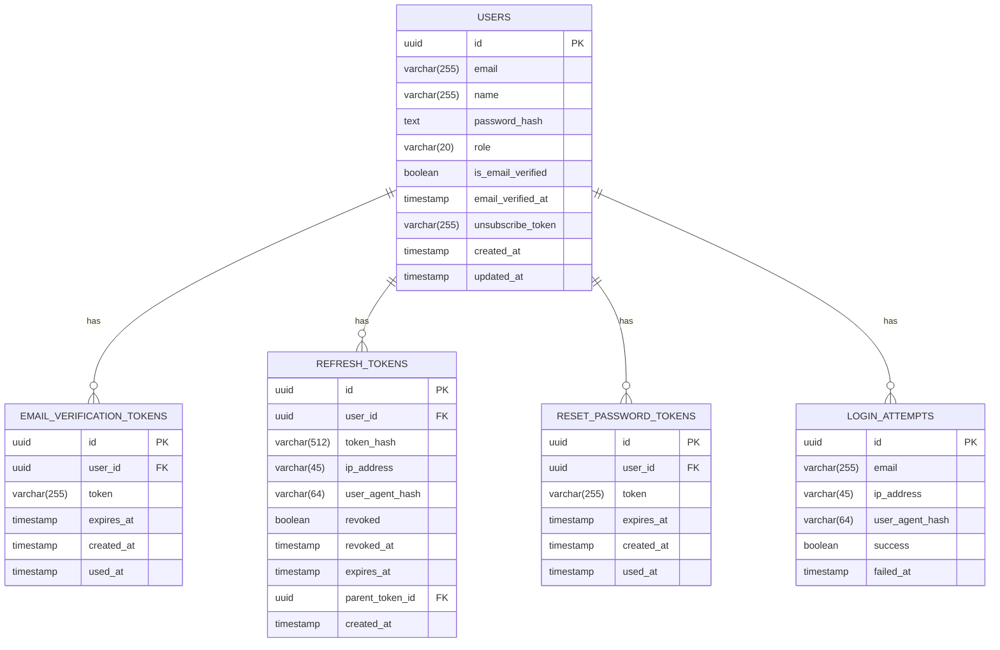

# 1. Архитектура

## 1.1 Общая архитектура системы

Следующая схема показывает общую структуру системы регистрации и авторизации, включая взаимодействие между компонентами:

---

## 1.2 Data Flow Diagrams / Диаграмма потоков данных

### Регистрация пользователя

Следующая диаграмма показывает пошаговый процесс регистрации нового пользователя:

### Аутентификация

Следующая диаграмма показывает процесс входа пользователя в систему:

### Обновление токена

Следующая диаграмма показывает процесс обновления access token через refresh token:

### Выход из системы

Следующая диаграмма показывает процесс выхода пользователя из системы (инвалидация текущей сессии):

### Подтверждение email

Следующая диаграмма показывает процесс подтверждения email пользователя:

### Запрос сброса пароля

Следующая диаграмма показывает процесс запроса сброса пароля:

### Сброс пароля

Следующая диаграмма показывает процесс сброса пароля пользователя:

---

## 1.3 Жизненный цикл токена

Следующая диаграмма показывает все состояния refresh token и переходы между ними:

### Описание состояний

| Состояние | Описание |
|-----------|----------|
| `Created` | Токен создан и хранится в БД, но ещё не использован |
| `Active` | Токен активен, может быть использован для refresh |
| `Revoked` | Токен инвалидирован (logout или компрометация) |
| `Expired` | Срок жизни токена истёк |

### Transition события

- **Token выдан** — при `/login`, `/verify` или `/refresh`
- **Rotation** — при каждом `/refresh` старый токен становится `Revoked`, создаётся новый `Active`
- **Logout** — текущий токен помечается как `Revoked`
- **Истечение срока** — автоматически через 7 дней

---

## 1.4 ER-диаграмма связей таблиц

Следующая диаграмма показывает связи между таблицами базы данных:

### Описание таблиц

| Таблица | Описание |
|---------|----------|
| `users` | Основная таблица пользователей |
| `email_verification_tokens` | Токены для подтверждения email (24 часа) |
| `refresh_tokens` | Токены обновления (7 дней), с поддержкой rotation |
| `reset_password_tokens` | Токены для сброса пароля (1 час) |
| `login_attempts` | Лог попыток входа для аудита |

### Связи

- `users` -> `email_verification_tokens` — один ко многим (CASCADED DELETE)
- `users` -> `refresh_tokens` — один ко многим (CASCADED DELETE)
- `users` -> `reset_password_tokens` — один ко многим (CASCADED DELETE)
- `users` -> `login_attempts` — один ко многим (для аудита)

---

## 1.5 Компоненты системы

### Базы данных

| Компонент | Назначение |
|-----------|------------|
| PostgreSQL | Хранение пользователей, токенов, логов |
| Redis | Rate limiting, сессии, черные списки токенов |

### Основные сервисы

| Компонент | Назначение |
|-----------|------------|
| API Gateway | Rate limiting, SSL termination |
| Auth Service | JWT generation/verification, password hashing, token management |

### Внешние сервисы

| Компонент | Назначение |
|-----------|------------|
| SMTP Server | Отправка email (верификация, сброс пароля) |
