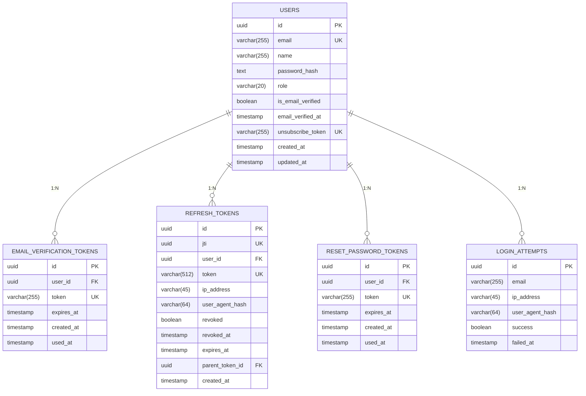

# 3. Схема базы данных

## 3.1 Обзор таблиц

Система использует 5 основных таблиц PostgreSQL для хранения данных пользователей, токенов и логов:



**Описание ER-диаграммы:**
ER-диаграмма показывает структуру базы данных системы аутентификации. Основная таблица `users` связана отношением один ко многим с четырьмя таблицами токенов: `email_verification_tokens` (токены подтверждения email), `refresh_tokens` (токены обновления с поддержкой rotation), `reset_password_tokens` (токены сброса пароля) и `login_attempts` (логи попыток входа для аудита). Все связи используют каскадное удаление (CASCADED DELETE), чтобы при удалении пользователя автоматически удалялись все связанные токены и логи.

---

## 3.2 Таблица users

| Поле              | Тип          | Описание                               |
| ----------------- | ------------ | -------------------------------------- |
| id                | UUID         | **PRIMARY KEY**                        |
| email             | VARCHAR(255) | UNIQUE, NOT NULL                       |
| name              | VARCHAR(255) | NOT NULL                               |
| password_hash     | TEXT         | NOT NULL                               |
| role              | VARCHAR(20)  | DEFAULT 'user'                         |
| is_email_verified | BOOLEAN      | DEFAULT false                          |
| email_verified_at | TIMESTAMP    | NULL                                   |
| unsubscribe_token | VARCHAR(255) | UNIQUE, NULL                           |
| created_at        | TIMESTAMP    | DEFAULT NOW()                          |
| updated_at        | TIMESTAMP    | DEFAULT NOW()                          |

**Описание полей:**

- `id` — уникальный идентификатор пользователя (UUIDv7, time-based)
- `email` — email для входа и коммуникации, уникальный
- `name` — отображаемое имя пользователя
- `password_hash` — хэш пароля (Argon2id), без соли
- `role` — роль пользователя: `user` или `admin`
- `is_email_verified` — флаг подтверждённого email
- `email_verified_at` — время подтверждения email (после verify)
- `unsubscribe_token` — токен для отписки от рассылки (URL-safe base64)
- `created_at` — время создания записи
- `updated_at` — время последнего обновления

**Индексы:**

| Имя индекса                  | Поле                | Назначение                              |
| ---------------------------- | ------------------- | --------------------------------------- |
| `idx_users_email`            | email               | Быстрый поиск при login/registration    |
| `idx_users_role`             | role                | Фильтрация по ролям                     |
| `idx_users_unsubscribe_token`| unsubscribe_token   | Быстрая отписка от рассылки            |
| `idx_users_created_at`       | created_at          | Сортировка по дате регистрации          |

**Примечания:**
- `email` имеет UNIQUE constraint для предотвращения дублирования
- `unsubscribe_token` генерируется при создании пользователя для GDPR compliance

---

## 3.3 Таблица email_verification_tokens

| Поле       | Тип          | Описание                                |
| ---------- | ------------ | --------------------------------------- |
| id         | UUID         | **PRIMARY KEY**                         |
| user_id    | UUID         | **FOREIGN KEY** → users(id) CASCADE     |
| token      | VARCHAR(255) | UNIQUE, NOT NULL (URL-safe base64 UUID) |
| expires_at | TIMESTAMP    | NOT NULL                                |
| created_at | TIMESTAMP    | DEFAULT NOW()                           |
| used_at    | TIMESTAMP    | NULL                                    |

**Описание полей:**

- `id` — уникальный идентификатор токена (UUIDv7)
- `user_id` — ссылка на пользователя, каскадное удаление (CASCADE)
- `token` — одноразовый токен для подтверждения, URL-safe base64 UUID
- `expires_at` — время истечения токена (24 часа от создания)
- `created_at` — время генерации токена
- `used_at` — время использования токена (после verify, NULL если не использован)

**Индексы:**

| Имя индекса              | Поле        | Назначение                         |
| ------------------------ | ----------- | ---------------------------------- |
| `idx_tokens_token`       | token       | Быстрый поиск по token             |
| `idx_tokens_user_id`     | user_id     | Поиск активных токенов пользователя|
| `idx_tokens_expires_at`  | expires_at  | Очистка истекших токенов          |

**SQL: Создание таблицы**

```sql
CREATE TABLE email_verification_tokens (
    id UUID PRIMARY KEY DEFAULT gen_random_uuid(),
    user_id UUID NOT NULL REFERENCES users(id) ON DELETE CASCADE,
    token VARCHAR(255) NOT NULL UNIQUE,
    expires_at TIMESTAMP NOT NULL,
    created_at TIMESTAMP DEFAULT NOW(),
    used_at TIMESTAMP
);

CREATE INDEX idx_tokens_token ON email_verification_tokens (token);
CREATE INDEX idx_tokens_user_id ON email_verification_tokens (user_id);
CREATE INDEX idx_tokens_expires_at ON email_verification_tokens (expires_at);
```

**Одноразовость токена:**

- В каждый момент у учётной записи действителен только последний выданный токен
- При повторной генерации токена (например, через `/v1/auth/resend-verification`) прежние токены **аннулируются**:
  - Старые записи обновляются: `used_at = NOW()` (физически не удаляются, но становятся невалидными)
  - Генерируется новый токен с новым `user_id` и `expires_at`
- Проверка валидности токена включает `used_at IS NULL`

**Удаление токена при verify:**

```sql
DELETE FROM email_verification_tokens 
WHERE token = ? 
  AND user_id = ? 
  AND used_at IS NULL 
  AND expires_at > NOW()
RETURNING id;
```

---

## 3.4 Таблица refresh_tokens

| Поле            | Тип          | Описание                                                                     |
| --------------- | ------------ | ---------------------------------------------------------------------------- |
| id              | UUID         | **PRIMARY KEY** (UUIDv4, внутренний идентификатор)                          |
| jti             | UUID         | **UNIQUE** (UUIDv7, JWT ID для revocation и поиска)                         |
| user_id         | UUID         | **FOREIGN KEY** → users(id) CASCADE                                          |
| token           | VARCHAR(512) | UNIQUE, NOT NULL (SHA-256 хэш от оригинального токена)                      |
| ip_address      | VARCHAR(45)  | NOT NULL (IP при выдаче токена, IPv4 или IPv6)                             |
| user_agent_hash | VARCHAR(64)  | NOT NULL (SHA-256 хэш от агрегированной информации user_agent)              |
| revoked         | BOOLEAN      | DEFAULT false                                                                |
| revoked_at      | TIMESTAMP    | NULL                                                                         |
| expires_at      | TIMESTAMP    | NOT NULL (7 дней от создания)                                                |
| parent_token_id | UUID         | **FOREIGN KEY** → refresh_tokens(id) NULL (для отслеживания rotation)       |
| created_at      | TIMESTAMP    | DEFAULT NOW()                                                                |

**Описание полей:**

- `id` — внутренний первичный ключ (UUIDv4, генерируется `gen_random_uuid()`)
- `jti` — JWT ID (UUIDv7), уникален для каждого токена, используется для revocation и поиска в БД
- `user_id` — ссылка на пользователя, каскадное удаление (CASCADE)
- `token` — SHA-256 хэш от оригинального токена (хранится в HTTP-only cookie)
- `ip_address` — IP-адрес (IPv4 или IPv6) при выдаче токена (для аудита)
- `user_agent_hash` — SHA-256 хэш от агрегированной информации user_agent (browser/os/device)
- `revoked` — флаг инвалидации (true после logout или компрометации)
- `revoked_at` — время инвалидации токена (NULL если активен)
- `expires_at` — время истечения токена (7 дней от создания)
- `parent_token_id` — ссылка на родительский токен при rotation (NULL для исходного токена)
- `created_at` — время выдачи токена

**Индексы:**

| Имя индекса                          | Поле               | Назначение                               |
| ------------------------------------ | ------------------ | ---------------------------------------- |
| `idx_refresh_tokens_jti`             | jti                | Поиск токена по JWT ID (revocation)       |
| `idx_refresh_tokens_token`           | token              | Быстрый поиск по хэшу                    |
| `idx_refresh_tokens_user_id`         | user_id            | Поиск активных токенов                   |
| `idx_refresh_tokens_expires_at`      | expires_at         | Очистка истекших токенов                 |
| `idx_refresh_tokens_ip`              | ip_address         | Аудит по IP                              |
| `idx_refresh_tokens_user_agent_hash` | user_agent_hash    | Аудит по типам устройств                 |
| `idx_refresh_tokens_parent_token_id` | parent_token_id    | Отслеживание цепочек ротации             |

**SQL: Создание таблицы**

```sql
CREATE TABLE refresh_tokens (
    id UUID PRIMARY KEY DEFAULT gen_random_uuid(),
    jti UUID NOT NULL UNIQUE,
    user_id UUID NOT NULL REFERENCES users(id) ON DELETE CASCADE,
    token VARCHAR(512) NOT NULL UNIQUE,
    ip_address VARCHAR(45) NOT NULL,
    user_agent_hash VARCHAR(64) NOT NULL,
    revoked BOOLEAN DEFAULT FALSE,
    revoked_at TIMESTAMP,
    expires_at TIMESTAMP NOT NULL,
    parent_token_id UUID REFERENCES refresh_tokens(id),
    created_at TIMESTAMP DEFAULT NOW()
);

CREATE INDEX idx_refresh_tokens_jti ON refresh_tokens (jti);
CREATE INDEX idx_refresh_tokens_token ON refresh_tokens (token);
CREATE INDEX idx_refresh_tokens_user_id ON refresh_tokens (user_id);
CREATE INDEX idx_refresh_tokens_expires_at ON refresh_tokens (expires_at);
CREATE INDEX idx_refresh_tokens_ip ON refresh_tokens (ip_address);
CREATE INDEX idx_refresh_tokens_user_agent_hash ON refresh_tokens (user_agent_hash);
CREATE INDEX idx_refresh_tokens_parent_token_id ON refresh_tokens (parent_token_id);
```

**Revocation Flow (с token binding):**

1. При logout: `UPDATE refresh_tokens SET revoked = TRUE, revoked_at = NOW() WHERE jti = ? AND user_id = ?`
2. При проверке refresh: `WHERE jti = ? AND revoked = FALSE AND expires_at > NOW() AND ip_address = ? AND user_agent_hash = ?`
3. **Token rotation:** при каждом refresh:
   - Генерируется новый токен с `parent_token_id = old_token_id`
   - Старый токен помечается как `revoked = TRUE`
   - Это создаёт цепочку ротации: `token_3 -> token_2 -> token_1 -> NULL`
4. Очистка: удаление revoked токенов старше N дней (cron-задача)

**Получение всей цепочки токенов пользователя:**

```sql
SELECT * FROM refresh_tokens 
WHERE user_id = ? 
ORDER BY created_at DESC;
```

**Где создаются refresh_tokens:**

- `/v1/auth/login` — при успешной авторизации
- `/v1/auth/verify` — при подтверждении email (создаётся **новый** refresh_token, даже если пользователь уже был залогинен)
- `/v1/auth/refresh` — при обновлении токенов (старый инвалидируется, создаётся новый)

---

## 3.5 Таблица reset_password_tokens

| Поле       | Тип          | Описание                               |
| ---------- | ------------ | -------------------------------------- |
| id         | UUID         | **PRIMARY KEY**                        |
| user_id    | UUID         | **FOREIGN KEY** → users(id) CASCADE    |
| token      | VARCHAR(255) | UNIQUE, NOT NULL (UUIDv7)              |
| expires_at | TIMESTAMP    | NOT NULL (1 час от создания)           |
| created_at | TIMESTAMP    | DEFAULT NOW()                          |
| used_at    | TIMESTAMP    | NULL                                   |

**Описание полей:**

- `id` — уникальный идентификатор токена (UUIDv7)
- `user_id` — ссылка на пользователя, каскадное удаление
- `token` — UUIDv7 для сброса пароля, одноразовый
- `expires_at` — время истечения токена (1 час от создания)
- `created_at` — время генерации токена
- `used_at` — время использования токена (после reset, NULL если не использован)

**Индексы:**

| Имя индекса             | Поле        | Назначение                         |
| ----------------------- | ----------- | ---------------------------------- |
| `idx_reset_token`       | token       | Быстрый поиск                       |
| `idx_reset_user_id`     | user_id     | Поиск активных токенов             |
| `idx_reset_expires_at`  | expires_at  | Очистка истекших токенов          |

**SQL: Создание таблицы**

```sql
CREATE TABLE reset_password_tokens (
    id UUID PRIMARY KEY DEFAULT gen_random_uuid(),
    user_id UUID NOT NULL REFERENCES users(id) ON DELETE CASCADE,
    token VARCHAR(255) NOT NULL UNIQUE,
    expires_at TIMESTAMP NOT NULL,
    created_at TIMESTAMP DEFAULT NOW(),
    used_at TIMESTAMP
);

CREATE INDEX idx_reset_token ON reset_password_tokens (token);
CREATE INDEX idx_reset_user_id ON reset_password_tokens (user_id);
CREATE INDEX idx_reset_expires_at ON reset_password_tokens (expires_at);
```

---

## 3.6 Таблица login_attempts

| Поле            | Тип          | Описание                                                                    |
| --------------- | ------------ | --------------------------------------------------------------------------- |
| id              | UUID         | **PRIMARY KEY**                                                             |
| email           | VARCHAR(255) | NOT NULL                                                                    |
| ip_address      | VARCHAR(45)  | NOT NULL                                                                    |
| user_agent_hash | VARCHAR(64)  | NOT NULL (SHA-256 хэш от базовой информации user_agent)                    |
| success         | BOOLEAN      | NOT NULL                                                                    |
| failed_at       | TIMESTAMP    | DEFAULT NOW()                                                               |

**Описание полей:**

- `id` — уникальный идентификатор записи (UUIDv7)
- `email` — email, с которого производилась попытка входа
- `ip_address` — IP-адрес (IPv4 или IPv6, VARCHAR(45) для поддержки IPv6)
- `user_agent_hash` — SHA-256 хэш от агрегированной информации user_agent (browser/os/device), без деталей
- `success` — результат попытки: true (успех) или false (неудача)
- `failed_at` — время попытки входа

**Индексы:**

| Имя индекса                         | Поле                  | Назначение                                   |
| ----------------------------------- | --------------------- | -------------------------------------------- |
| `idx_attempts_email_ip`             | email, ip_address     | Анализ атак (brute force по IP/email)       |
| `idx_attempts_failed_at`            | failed_at             | Очистка старых записей                       |
| `idx_attempts_email_success`        | email, success        | Статистика успешных/неуспешных входов        |
| `idx_attempts_user_agent_hash`      | user_agent_hash       | Группировка по типам устройств               |

**SQL: Создание таблицы**

```sql
CREATE TABLE login_attempts (
    id UUID PRIMARY KEY DEFAULT gen_random_uuid(),
    email VARCHAR(255) NOT NULL,
    ip_address VARCHAR(45) NOT NULL,
    user_agent_hash VARCHAR(64) NOT NULL,
    success BOOLEAN NOT NULL,
    failed_at TIMESTAMP DEFAULT NOW()
);

CREATE INDEX idx_attempts_email_ip ON login_attempts (email, ip_address);
CREATE INDEX idx_attempts_failed_at ON login_attempts (failed_at);
CREATE INDEX idx_attempts_email_success ON login_attempts (email, success);
CREATE INDEX idx_attempts_user_agent_hash ON login_attempts (user_agent_hash);
```

**Комментарии:**

- Логируются все попытки входа (успешные и неуспешные)
- Для rate limiting: count за последние N минут по IP
- Для блокировки: count неудачных по email за час
- `user_agent_hash` хранится для аудита без возможности восстановления полного User-Agent (GDPR compliance)

---

## 3.7 Redis Keys

### Категория: Rate Limiting

| Ключ                           | Тип    | Описание                                    | TTL    |
| ------------------------------ | ------ | ------------------------------------------- | ------ |
| `rate_limit:login:{ip}`        | String | Счетчик логинов по IP                       | 10 мин |
| `rate_limit:login:block:{email}`| String | Блокировка аккаунта после неудач            | 15-24 ч|
| `rate_limit:register:{ip}`     | String | Счетчик регистраций по IP                   | 1 час  |
| `rate_limit:verify:{ip}`       | String | Счетчик верификаций по IP                   | 1 час  |
| `rate_limit:forgot-password:{ip}`| String | Счетчик запросов сброса по IP              | 1 час  |
| `rate_limit:reset-password:{ip}`| String | Счетчик сбросов по IP                       | 1 час  |
| `rate_limit:refresh:{ip}`      | String | Счетчик refresh запросов по IP              | 10 мин |
| `rate_limit:change-password:{ip}`| String | Счетчик смен паролей по IP                 | 1 час  |

**Использование:**
```javascript
// Пример: проверка лимита логинов
INCR rate_limit:login:192.168.1.1
EXPIRE rate_limit:login:192.168.1.1 600
GET rate_limit:login:192.168.1.1  // вернёт текущий счётчик
```

### Категория: Session Management

| Ключ                                   | Тип    | Описание                                                    | TTL   |
| -------------------------------------- | ------ | ----------------------------------------------------------- | ----- |
| `session:{refresh_token_hash}`         | Hash   | Информация о сессии (user_id, created_at, jti, ip, ua_hash) | 7 дней|
| `revoked_tokens:{refresh_token_hash}`  | String | Флаг инвалидации токена                                     | 7 дней|
| `revoked_access_jti:{jti}`             | String | Флаг инвалидации access token по jti                        | 30 мин|

**Использование:**
```javascript
// Пример: сохранение сессии
HSET session:abc123 user_id "uuid" created_at "1726989600" jti "uuid" ip_address "192.168.1.1" user_agent_hash "hash"

// Пример: проверка ревокации
GET revoked_tokens:abc123  // вернёт "1" если токен отозван
```

### Категория: Locks (Блокировки)

| Ключ                              | Тип    | Описание                              | TTL   |
| --------------------------------- | ------ | ------------------------------------- | ----- |
| `lock:register:{email}`           | String | Блокировка после неудачной регистрации| 1 час |
| `lock:forgot-password:{email}`    | String | Блокировка после неудачного сброса    | 1 час |

### Категория: User Agent Metadata

| Ключ                              | Тип    | Описание                              | TTL   |
| --------------------------------- | ------ | ------------------------------------- | ----- |
| `user_agent:hash:{hash}`          | String | Метаинформация по хэшу User-Agent (browser/os/device) | 30 дней |

---

## 3.8 Порядок применения миграций

Миграции базы данных управляются с помощью **goose**:

```
migrations/
├── 00001_create_users_table.up.sql
├── 00001_create_users_table.down.sql
├── 00002_create_tokens_tables.up.sql
├── 00002_create_tokens_tables.down.sql
├── 00003_add_indexes.up.sql
├── 00003_add_indexes.down.sql
└── ...
```

**Команды:**
```bash
# Применить все миграции
goose postgres "host=localhost db=mydb user=postgres" up

# Откатить последнюю миграцию
goose postgres "host=localhost db=mydb user=postgres" down

# Показать статус миграций
goose postgres "host=localhost db=mydb user=postgres" status
```

---

## 3.9 Правила именования

- **Таблицы:** `snake_case` (plural): `users`, `refresh_tokens`, `login_attempts`
- **Индексы:** `idx_{table}_{column}` или `idx_{table}_{columns}`
- **Внешние ключи:** `fk_{table}_{column}` (если не указан явно, goose генерирует имя)
- **Переменные окружения:** `DB_*` префикс для БД, `REDIS_*` для Redis
