# 4. Конечные точки API

## 4.0 Общие правила API

### Структура URL

```
https://api.mystore.com/v1/auth/{endpoint}
```

Версия API: `v1`

### Аутентификация

Большинство endpoints используют **Bearer Token** в заголовке `Authorization`:

```
Authorization: Bearer <access_token>
```

Для `/v1/auth/refresh` используется **double-submit cookie pattern**:
- `access_token` передаётся в `Authorization: Bearer <token>`
- `refresh_token` автоматически отправляется как HTTP-only cookie

### Стандартные заголовки

| Заголовок | Обязательный | Описание |
|-----------|--------------|----------|
| `Content-Type` | Для POST/PUT/PATCH | `application/json` |
| `Authorization` | Для защищённых endpoints | `Bearer <access_token>` |
| `Accept` | Опционально | `application/json` |

---

### Общая структура ответа

**Успех (2xx):**
```json
{
  "field1": "value1",
  "field2": "value2"
}
```

**Ошибка (4xx/5xx):**
```json
{
  "error": {
    "code": "ERROR_CODE",
    "message": "Описание ошибки на русском",
    "details": {}
  }
}
```

### Коды ошибок

| Код | Описание | HTTP Status |
|-----|----------|-------------|
| `VALIDATION_ERROR` | Ошибка валидации данных | 400 |
| `EMAIL_ALREADY_REGISTERED` | Email уже зарегистрирован | 409 |
| `RATE_LIMITED` | Превышен лимит запросов | 429 |
| `CONFIRMATION_TOKEN_INVALID` | Неверный или истекший токен | 400 |
| `EMAIL_ALREADY_CONFIRMED` | Email уже подтверждён | 409 |
| `INVALID_CREDENTIALS` | Неверные учётные данные | 401 |
| `EMAIL_NOT_CONFIRMED` | Email не подтверждён | 403 |
| `REFRESH_TOKEN_INVALID` | Неверный токен обновления | 401 |
| `ACCESS_TOKEN_INVALID` | Неверный или истекший токен доступа | 401 |
| `INVALID_TOKEN` | Неверный токен (общий) | 400 |
| `TOKEN_NOT_FOUND` | Токен не найден | 404 |
| `USER_NOT_FOUND` | Пользователь не найден | 404 |
| `WEAK_PASSWORD` | Новый пароль не соответствует требованиям | 400 |
| `EMAIL_ALREADY_VERIFIED` | Email уже подтверждён | 409 |

---

## 4.1 Справочник endpoints

| Метод | Endpoint | Описание | Аутентификация |
|-------|----------|----------|----------------|
| POST | `/v1/auth/register` | Регистрация нового пользователя | Нет |
| POST | `/v1/auth/verify` | Подтверждение email | Нет |
| POST | `/v1/auth/login` | Авторизация пользователя | Нет |
| POST | `/v1/auth/refresh` | Обновление access token | Bearer + Cookie |
| POST | `/v1/auth/logout` | Выход из системы | Bearer |
| GET | `/v1/auth/me` | Получение данных текущего пользователя | Bearer |
| POST | `/v1/auth/resend-verification` | Повторная отправка verification email | Нет |
| POST | `/v1/auth/forgot-password` | Запрос сброса пароля | Нет |
| POST | `/v1/auth/reset-password` | Сброс пароля с токеном | Нет |
| POST | `/v1/auth/unsubscribe` | Отписка от рассылки | Нет |
| PUT | `/v1/auth/change-password` | Изменение пароля | Bearer |
| DELETE | `/v1/auth/me` | Удаление аккаунта | Bearer |

---

## 4.2 POST /v1/auth/register

**Описание:** Регистрация нового пользователя

**Схема:**
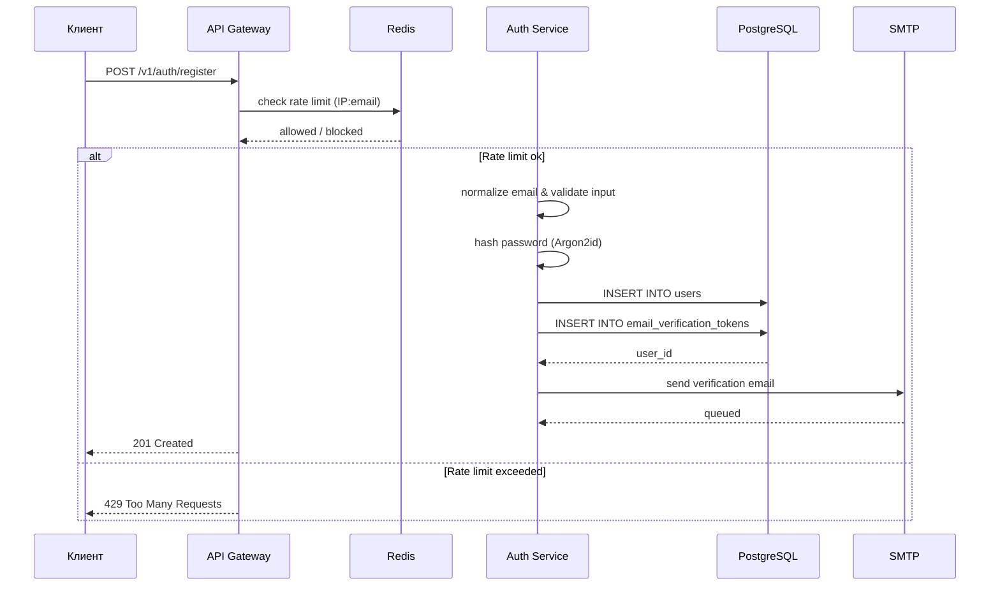

**Request Body:**

```json
{
  "email": "user@example.com",
  "password": "SecurePass123",
  "name": "Иван Иванов"
}
```

**Validation Rules:**

| Поле | Обязательное | Валидация |
|------|-------------|-----------|
| `email` | да | valid email format |
| `password` | да | min 8 characters |
| `name` | да | min 1 character |

**Success Response (201):**

```json
{
  "message": "Registration successful. Please check your email to verify your account.",
  "email": "user@example.com"
}
```

**Error Responses:**

| Код | Описание | Пример |
|-----|----------|--------|
| `400 VALIDATION_ERROR` | Ошибка валидации данных | `{"error": {"code": "VALIDATION_ERROR", "message": "...", "fields": [...]}}` |
| `409 EMAIL_ALREADY_REGISTERED` | Email уже зарегистрирован | `{"error": {"code": "EMAIL_ALREADY_REGISTERED", "message": "..."}}` |
| `429 RATE_LIMITED` | Превышен лимит запросов | `{"error": {"code": "RATE_LIMITED", "message": "...", "details": {"retry_after": 3600}}}` |

**Пример curl:**

```bash
curl -X POST https://api.mystore.com/v1/auth/register \
  -H "Content-Type: application/json" \
  -d '{
    "email": "user@example.com",
    "password": "SecurePass123",
    "name": "Иван Иванов"
  }'
```

---

## 4.3 POST /v1/auth/verify

**Описание:** Подтверждение email с одноразовым токеном

**Схема:**
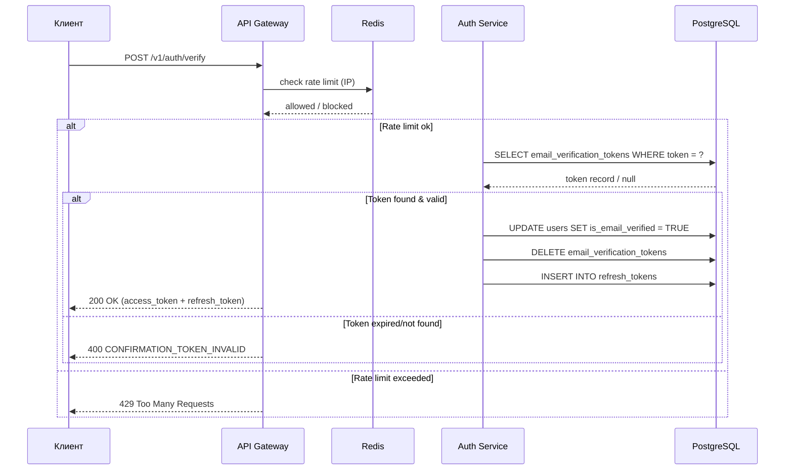

**Request Body:**

```json
{
  "token": "abc123..."
}
```

**Success Response (200):**

```json
{
  "access_token": "eyJhbG...",
  "refresh_token": "eyJhbG..."
}
```

**Error Responses:**

| Код | Описание | Пример |
|-----|----------|--------|
| `400 CONFIRMATION_TOKEN_INVALID` | Неверный или истекший токен | `{"error": {"code": "CONFIRMATION_TOKEN_INVALID", "message": "..."}}` |
| `409 EMAIL_ALREADY_CONFIRMED` | Email уже подтверждён | `{"error": {"code": "EMAIL_ALREADY_CONFIRMED", "message": "..."}}` |

**Пояснение: Почему возвращаются два токена?**

После успешной верификации email возвращаются **оба токена** (`access_token` и `refresh_token`) по следующим причинам:

1. **Непрерывность сессии** — пользователь продолжает работать без повторного логина
2. **Единообразие flow'ев** — верификация — это завершение регистрации, а не отдельный endpoint
3. **Безопасность refresh token** — `refresh_token` передаётся как HTTP-only cookie
4. **Token rotation** — при каждом `/v1/auth/verify` генерируется **новый refresh token**
5. **Off-session verify** — пользователь может подтвердить email в другом браузере

**Пример curl:**

```bash
curl -X POST https://api.mystore.com/v1/auth/verify \
  -H "Content-Type: application/json" \
  -d '{
    "token": "abc123xyz"
  }'
```

---

## 4.4 POST /v1/auth/login

**Описание:** Авторизация пользователя

**Схема:**
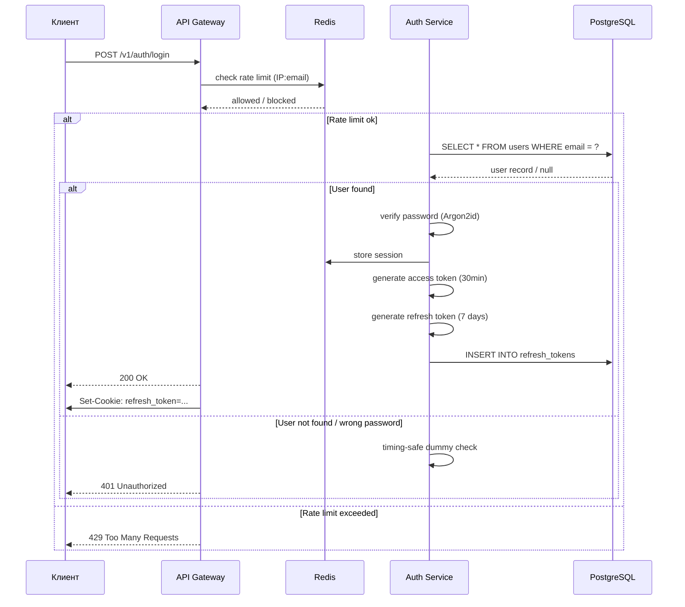

**Request Body:**

```json
{
  "email": "user@example.com",
  "password": "SecurePass123"
}
```

**Success Response (200):**

```json
{
  "access_token": "eyJhbG..."
}
```

**Error Responses:**

| Код | Описание | Пример |
|-----|----------|--------|
| `401 INVALID_CREDENTIALS` | Неверные учётные данные | `{"error": {"code": "INVALID_CREDENTIALS", "message": "..."}}` |
| `403 EMAIL_NOT_CONFIRMED` | Email не подтверждён | `{"error": {"code": "EMAIL_NOT_CONFIRMED", "message": "..."}}` |
| `429 RATE_LIMITED` | Превышен лимит запросов | `{"error": {"code": "RATE_LIMITED", "message": "..."}}` |

**Пример curl:**

```bash
curl -X POST https://api.mystore.com/v1/auth/login \
  -H "Content-Type: application/json" \
  -d '{
    "email": "user@example.com",
    "password": "SecurePass123"
  }'
```

---

## 4.5 POST /v1/auth/refresh

**Описание:** Получение нового access token с rotation refresh token

**Схема:**
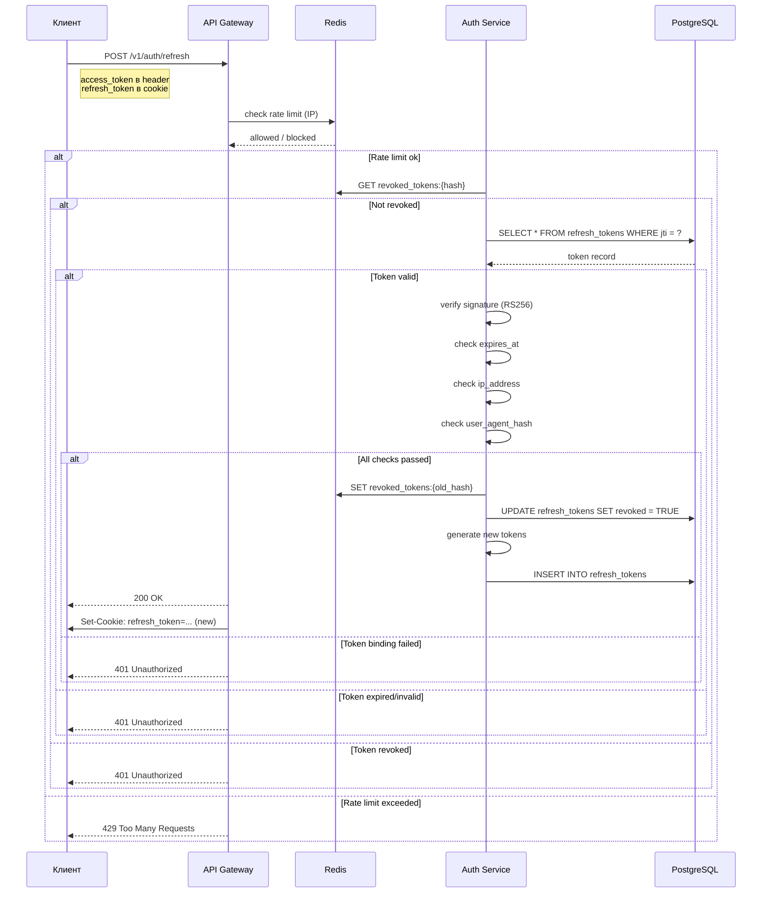

**Headers:**

```
Authorization: Bearer <access_token>
```

**Refresh Token Location:** HTTP-only cookie (`refresh_token`)

**Success Response (200):**

```json
{
  "access_token": "eyJhbG...",
  "token_type": "bearer",
  "expires_in": 1800
}
```

**Примечание:** `refresh_token` не возвращается в response body, так как он автоматически устанавливается как HTTP-only cookie.

**Error Responses:**

| Код | Описание | Пример |
|-----|----------|--------|
| `401 REFRESH_TOKEN_INVALID` | Неверный или истекший токен обновления | `{"error": {"code": "REFRESH_TOKEN_INVALID", "message": "..."}}` |
| `429 RATE_LIMITED` | Превышен лимит запросов | `{"error": {"code": "RATE_LIMITED", "message": "..."}}` |

**Пример curl:**

```bash
curl -X POST https://api.mystore.com/v1/auth/refresh \
  -H "Authorization: Bearer eyJhbG..." \
  --cookie-jar cookies.txt \
  --cookie cookies.txt
```

---

## 4.6 POST /v1/auth/logout

**Описание:** Выход из системы (инвалидация refresh token текущей сессии)

> **Важно:** Logout завершает **только текущую сессию**. В других браузерах или устройствах пользователь остаётся в системе.

**Схема:**
```mermaid
sequenceDiagram
    participant C as Клиент
    participant G as API Gateway
    participant R as Redis
    participant A as Auth Service
    participant PG as PostgreSQL

    C->>G: POST /v1/auth/logout
    note right of C: access_token в header<br/>refresh_token в cookie
    G->>R: check rate limit (IP)
    R-->>G: allowed / blocked
    alt Rate limit ok
        A->>R: GET revoked_tokens:{hash}
        alt Not revoked
            A->>PG: SELECT refresh_tokens WHERE jti = ?
            PG-->>A: token record
            alt Token valid
                A->>R: SET revoked_tokens:{hash} EX 604800
                A->>PG: UPDATE refresh_tokens SET revoked = TRUE
                G->>C: Set-Cookie: refresh_token=; Max-Age=0
                G-->>C: 200 OK
            else Token invalid
                G-->>C: 401 Unauthorized
            end
        else Token already revoked
            G-->>C: 200 OK
        end
    else Rate limit exceeded
        G-->>C: 429 Too Many Requests
    end
```

**Headers:**

```
Authorization: Bearer <access_token>
```

**Success Response (200):**

```json
{
  "message": "Вы успешно вышли из системы"
}
```

**Error Responses:**

| Код | Описание | Пример |
|-----|----------|--------|
| `401 ACCESS_TOKEN_INVALID` | Неверный или истекший токен доступа | `{"error": {"code": "ACCESS_TOKEN_INVALID", "message": "..."}}` |

**Как работает logout:**

1. Инвалидирует текущий refresh token (`revoked = TRUE`)
2. Добавляет `jti` в Redis blacklist с TTL = оставшееся время жизни
3. Очищает cookie (`Set-Cookie: refresh_token=; Max-Age=0`)
4. **Не инвалидирует другие активные сессии**

**Access token после logout:**
- Access token **не инвалидируется** и остаётся действительным до `exp` (30 минут)
- Клиент должен удалить access token из памяти

**Пример curl:**

```bash
curl -X POST https://api.mystore.com/v1/auth/logout \
  -H "Authorization: Bearer eyJhbG..."
```

---

## 4.7 GET /v1/auth/me

**Описание:** Получение данных текущего пользователя

**Схема:**
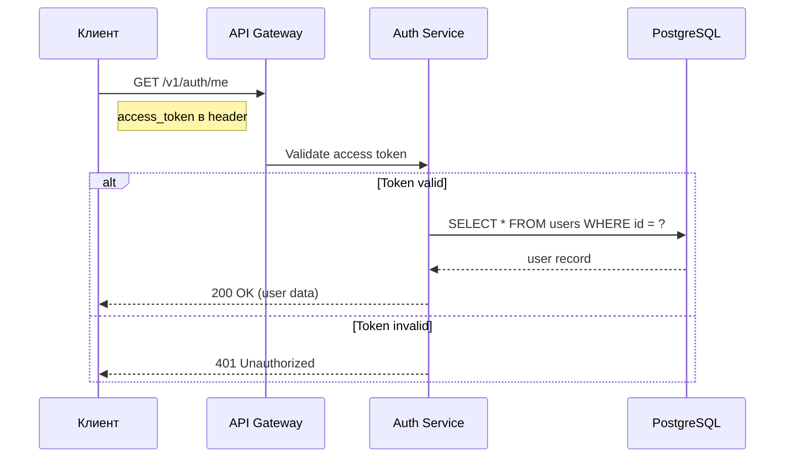

**Headers:**

```
Authorization: Bearer <access_token>
```

**Success Response (200):**

```json
{
  "id": "550e8400-e29b-41d4-a716-446655440000",
  "email": "user@example.com",
  "name": "Иван Иванов",
  "role": "user",
  "is_email_verified": true,
  "created_at": "2024-01-15T10:30:00Z"
}
```

**Error Responses:**

| Код | Описание | Пример |
|-----|----------|--------|
| `401 ACCESS_TOKEN_INVALID` | Неверный или истекший токен доступа | `{"error": {"code": "ACCESS_TOKEN_INVALID", "message": "..."}}` |

**Пример curl:**

```bash
curl https://api.mystore.com/v1/auth/me \
  -H "Authorization: Bearer eyJhbG..."
```

---

## 4.8 POST /v1/auth/resend-verification

**Описание:** Повторная отправка email с подтверждением

**Схема:**
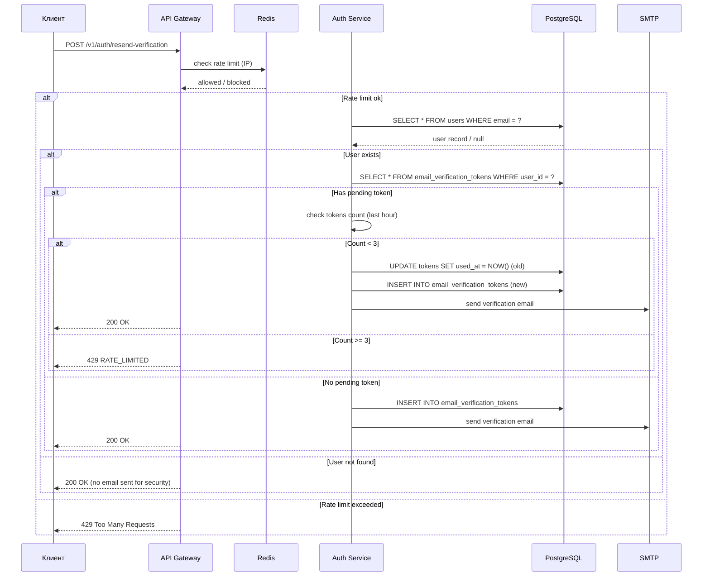

**Request Body:**

```json
{
  "email": "user@example.com"
}
```

**Success Response (200):**

```json
{
  "message": "Письмо с подтверждением отправлено. Пожалуйста, проверьте почту."
}
```

**Error Responses:**

| Код | Описание | Пример |
|-----|----------|--------|
| `409 EMAIL_ALREADY_VERIFIED` | Email уже подтверждён | `{"error": {"code": "EMAIL_ALREADY_VERIFIED", "message": "..."}}` |
| `429 RATE_LIMITED` | Превышен лимит запросов | `{"error": {"code": "RATE_LIMITED", "message": "..."}}` |

**Поведение:**

| Состояние учётной записи | Действие | Ответ |
| ----------------------- | -------- | ----- |
| Email уже подтверждён | Письмо не отправляется | `200 OK` с сообщением `{"message": "Email уже подтверждён"}` |
| 3+ писем за последний час | Письмо не отправляется | `429 RATE_LIMITED` |
| Есть pending-токен, < 3 писем | Старые токены аннулируются, выпускается новый | `200 OK` |
| Учётной записи не существует | Письмо не отправляется | `200 OK` (для безопасности) |

**Пример curl:**

```bash
curl -X POST https://api.mystore.com/v1/auth/resend-verification \
  -H "Content-Type: application/json" \
  -d '{
    "email": "user@example.com"
  }'
```

---

## 4.9 POST /v1/auth/forgot-password

**Описание:** Запрос на сброс пароля

**Схема:**
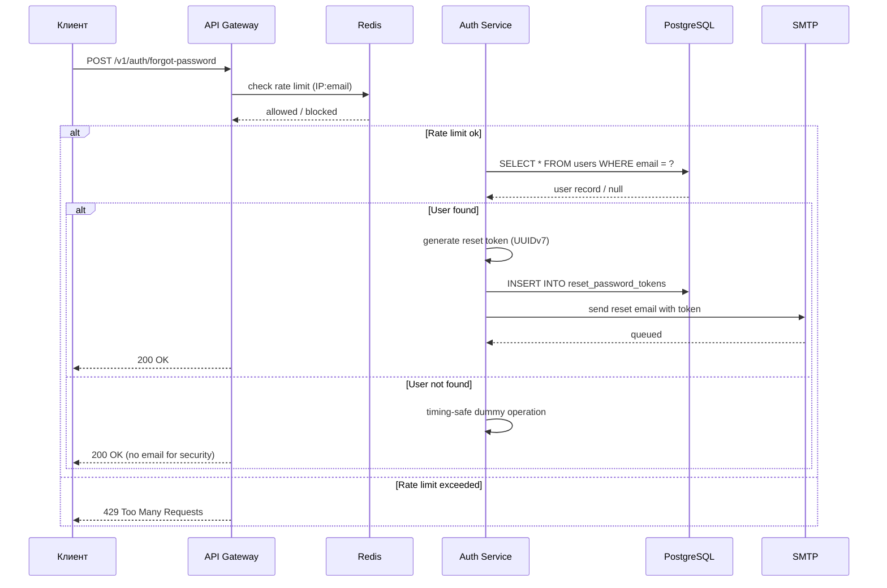

**Request Body:**

```json
{
  "email": "user@example.com"
}
```

**Success Response (200):**

```json
{
  "message": "Инструкции по сбросу пароля отправлены на email."
}
```

**Behavior:** Не раскрывает существование email (для безопасности). Возвращает `200 OK` для любых запросов.

**Error Responses:**

| Код | Описание | Пример |
|-----|----------|--------|
| `429 RATE_LIMITED` | Превышен лимит запросов | `{"error": {"code": "RATE_LIMITED", "message": "...", "details": {"retry_after": 3600}}}` |

**Пример curl:**

```bash
curl -X POST https://api.mystore.com/v1/auth/forgot-password \
  -H "Content-Type: application/json" \
  -d '{
    "email": "user@example.com"
  }'
```

---

## 4.10 POST /v1/auth/reset-password

**Описание:** Сброс пароля с токеном

**Схема:**
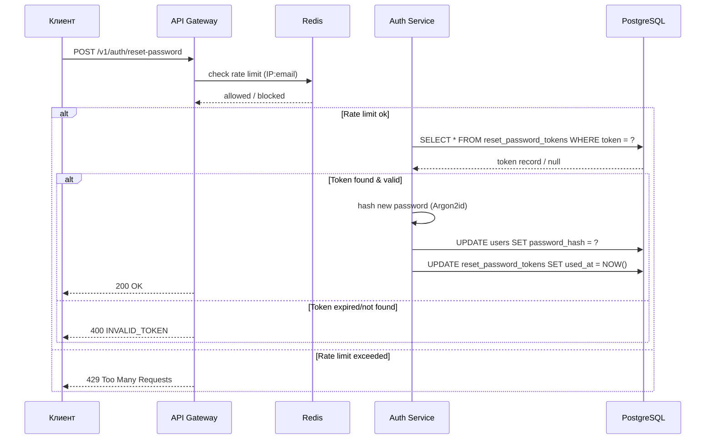

**Request Body:**

```json
{
  "token": "reset-token-from-email",
  "password": "NewSecurePass123"
}
```

**Success Response (200):**

```json
{
  "message": "Пароль успешно сброшен."
}
```

**Error Responses:**

| Код | Описание | Пример |
|-----|----------|--------|
| `400 INVALID_TOKEN` | Неверный или истекший токен | `{"error": {"code": "INVALID_TOKEN", "message": "..."}}` |
| `400 EXPIRED_TOKEN` | Токен сброса пароля истёк | `{"error": {"code": "EXPIRED_TOKEN", "message": "..."}}` |
| `404 TOKEN_NOT_FOUND` | Токен не найден | `{"error": {"code": "TOKEN_NOT_FOUND", "message": "..."}}` |
| `429 RATE_LIMITED` | Превышен лимит запросов | `{"error": {"code": "RATE_LIMITED", "message": "..."}}` |

**Пример curl:**

```bash
curl -X POST https://api.mystore.com/v1/auth/reset-password \
  -H "Content-Type: application/json" \
  -d '{
    "token": "reset-token-from-email",
    "password": "NewSecurePass123"
  }'
```

---

## 4.11 POST /v1/auth/unsubscribe

**Описание:** Отписка от коммерческой рассылки (GDPR/КоАП)

**Схема:**
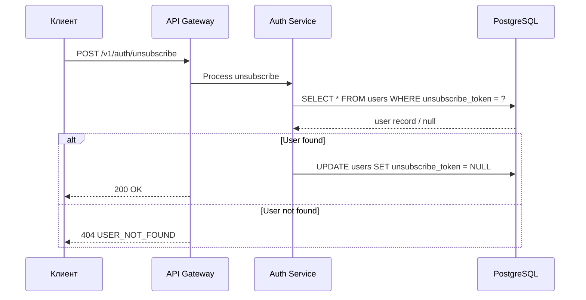

**Request Body:**

```json
{
  "token": "unsubscribe-token-from-email"
}
```

**Success Response (200):**

```json
{
  "message": "Успешная отписка от рассылки"
}
```

**Error Responses:**

| Код | Описание | Пример |
|-----|----------|--------|
| `400 INVALID_TOKEN` | Неверный или истекший токен | `{"error": {"code": "INVALID_TOKEN", "message": "..."}}` |
| `404 USER_NOT_FOUND` | Пользователь не найден | `{"error": {"code": "USER_NOT_FOUND", "message": "..."}}` |

**Пример curl:**

```bash
curl -X POST https://api.mystore.com/v1/auth/unsubscribe \
  -H "Content-Type: application/json" \
  -d '{
    "token": "unsubscribe-token-from-email"
  }'
```

---

## 4.12 PUT /v1/auth/change-password

**Описание:** Изменение пароля

**Схема:**
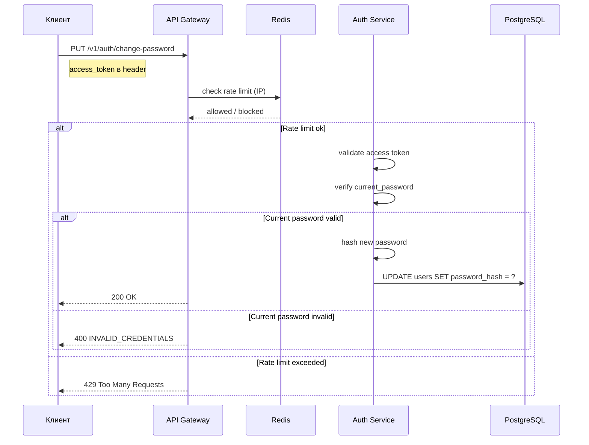

**Headers:**

```
Authorization: Bearer <access_token>
```

**Request Body:**

```json
{
  "current_password": "OldPass123",
  "new_password": "NewSecurePass456"
}
```

**Success Response (200):**

```json
{
  "message": "Пароль успешно изменен."
}
```

**Error Responses:**

| Код | Описание | Пример |
|-----|----------|--------|
| `400 INVALID_CREDENTIALS` | Текущий пароль неверный | `{"error": {"code": "INVALID_CREDENTIALS", "message": "..."}}` |
| `400 WEAK_PASSWORD` | Новый пароль не соответствует требованиям | `{"error": {"code": "WEAK_PASSWORD", "message": "..."}}` |
| `401 ACCESS_TOKEN_INVALID` | Неверный или истекший токен доступа | `{"error": {"code": "ACCESS_TOKEN_INVALID", "message": "..."}}` |
| `429 RATE_LIMITED` | Превышен лимит запросов | `{"error": {"code": "RATE_LIMITED", "message": "..."}}` |

**Пример curl:**

```bash
curl -X PUT https://api.mystore.com/v1/auth/change-password \
  -H "Authorization: Bearer eyJhbG..." \
  -H "Content-Type: application/json" \
  -d '{
    "current_password": "OldPass123",
    "new_password": "NewSecurePass456"
  }'
```

---

## 4.13 DELETE /v1/auth/me

**Описание:** Удаление аккаунта текущего пользователя (GDPR compliance)

**Схема:**
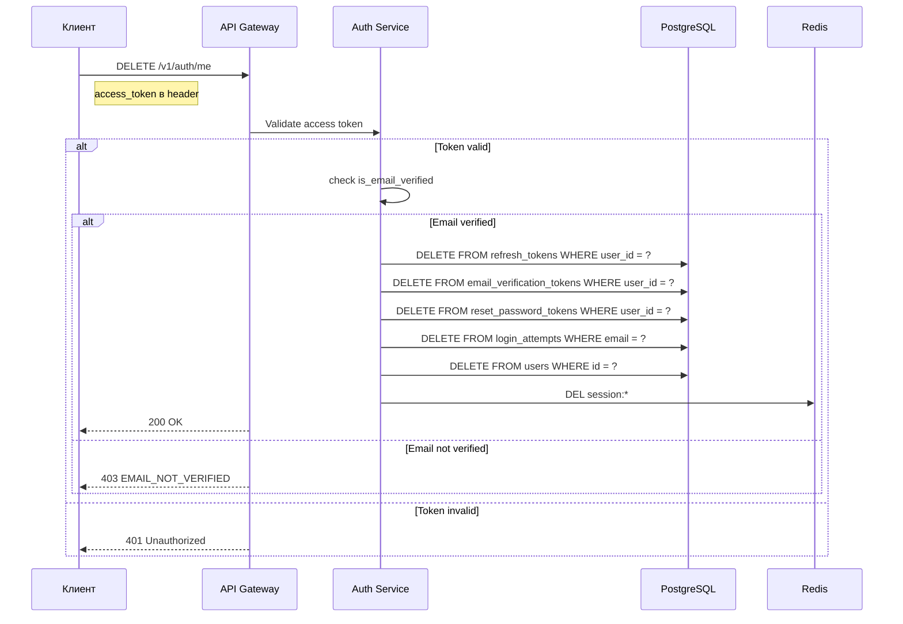

**Headers:**

```
Authorization: Bearer <access_token>
```

**Success Response (200):**

```json
{
  "message": "Аккаунт удалён навсегда."
}
```

**Error Responses:**

| Код | Описание | Пример |
|-----|----------|--------|
| `401 ACCESS_TOKEN_INVALID` | Неверный или истекший токен доступа | `{"error": {"code": "ACCESS_TOKEN_INVALID", "message": "..."}}` |
| `403 EMAIL_NOT_VERIFIED` | Email не подтверждён | `{"error": {"code": "EMAIL_NOT_VERIFIED", "message": "..."}}` |

**Пример curl:**

```bash
curl -X DELETE https://api.mystore.com/v1/auth/me \
  -H "Authorization: Bearer eyJhbG..."
```
